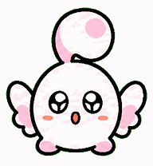
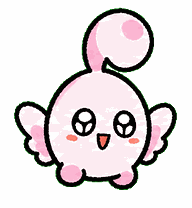
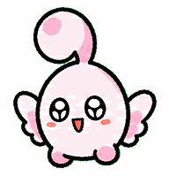
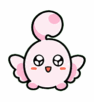
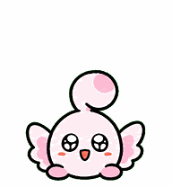
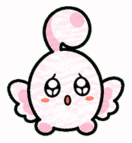
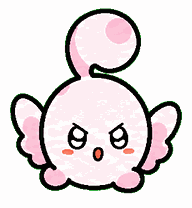
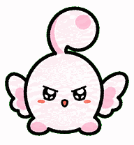
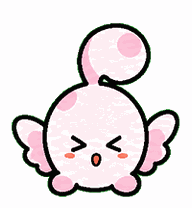

# 小锐桌宠

一个会待在桌面上、会互动、会聊天的 RIC 吉祥物小精灵。

最开始只是想看看 Codex 桌宠能做到什么程度，后来索性开发了一个桌面 App，并给小锐接入 AI。

小锐的动作帧先由 `hatch-pet` skill 生成，再用 `Electron` 补上桌面端框架。

如果喜欢小锐，请点一个 Star 吧 

> Demo

https://github.com/user-attachments/assets/f41f806a-4464-494a-9e4b-6b620f71aba7

## 所有动作

| 动作 | 触发 / 用途 | 预览 |
| --- | --- | --- |
| 待机 `idle` | 默认状态 |  |
| 向右跑动 `runRight` | 拖拽身体向右移动时触发 |  |
| 向左跑动 `runLeft` | 拖拽身体向左移动时触发 |  |
| 打招呼 `wave` | 初次进入聊天时触发 |  |
| 跳跃 `jump` | 思考中触发。 |  |
| 失败 `failed` | 请求失败或出错时播放 |  |
| 等待 `waiting` | AI 回复等待中触发 |  |
| 工作中 `working` | AI 回复生成中触发 |  |
| 审阅 `review` | AI 回复生成中触发 |  |
| 拖拽触角 `antennaHang` | 触角被拖拽时触发 |  |

## 功能概览

- 桌面常驻：小锐会一直陪着你。
- 拖拽互动：拖拽小锐的触角和身体会触发不同效果。
- 聊天：鼠标靠近小锐，会滑出聊天框。
- 接入AI：支持官方、备用、自定义三种AI来源。
- 专注模式：工作 App 在前台时，小锐自动让开，不抢注意力。
- 香港天气：问到天气时，可联网获取香港天气信息。
- 设置面板：大小、动作、聊天、专注、启动项等更多功能。
